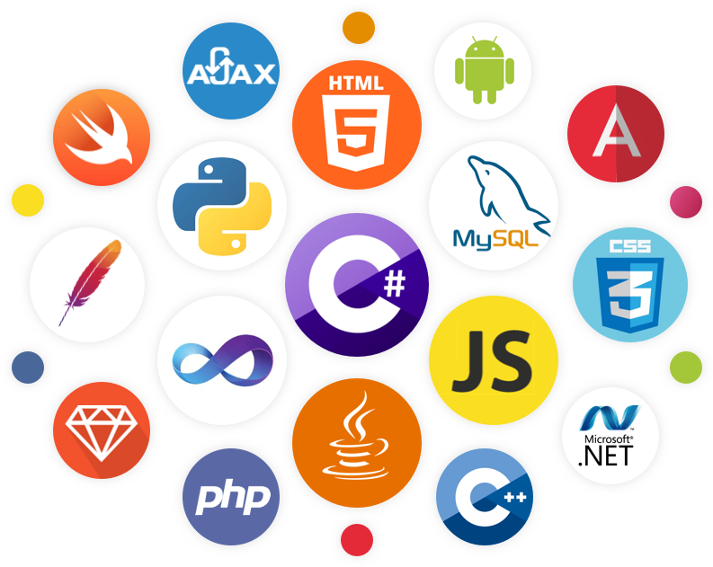
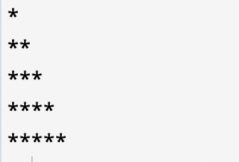

title: Python - Basic
author:
  name: 咪路
  email: mail@mirumo.org
output: ./introduction/index.html
style: ../main.css
--

<h1 style="font-size: 72px">
	Python - Introduct
</h1>
 
## 資訊學院 / 咪路

--

### Who Am I
<h2 style="font-size: 48px">
  <b>咪路</b>
</h2>
- SITCON'21 開發組組長
- 網頁應用、行動裝置 App
- mail@mirumo.org
- <a href="https://mirumo.org" target="_blank">About Me</a>

--

### 有聽過/學過什麼程式語言嗎？

--

### What is Python ?
> Python is a programming language that lets you work more quickly and integrate your systems more effectively.<a href="https://www.python.org/" target="_blank">python 官網</a>

	<b>總之，就是一個很受歡迎的語言</b>

--

### Why is Python ?
- 簡單好學
- 跨平台
- 廣泛的應用

--

### Python 的缺點
- 執行速度慢
- 種種原因使得除錯困難
	- 動態作用域
	- 捨去了資料型態的宣告
- ~~他是一個不用大括號的邪教~~

--

# Online IDE
## <a href="https://replit.com" target="_black">Replit.com</a> / <a href="https://www.programiz.com/python-programming/online-compiler/" target="_black">Programiz.com</a>

--

# Hello World!
## print('Hello World!')

--

<h1 style="font-size: 1.8em;">註解</h1>
## # 註解內容(這裡面部會被python編譯)

--

### Practice

